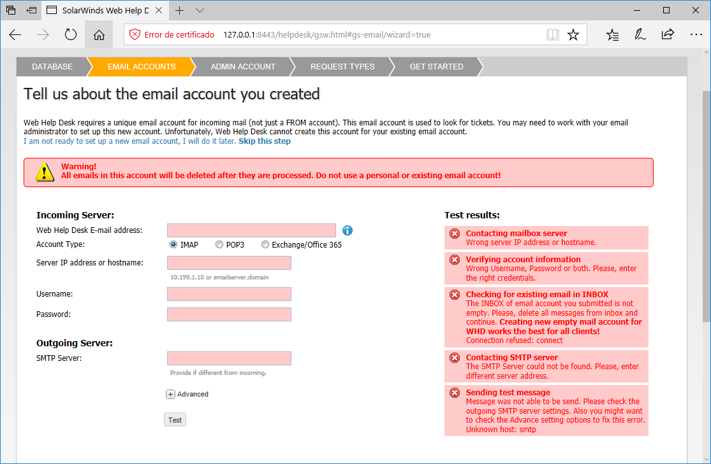
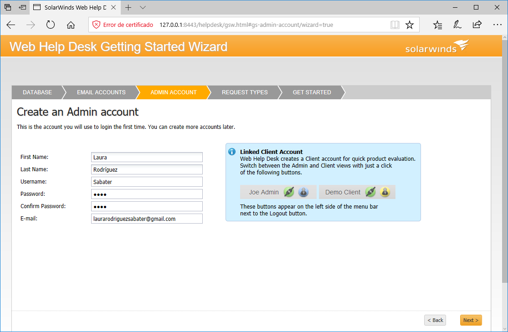
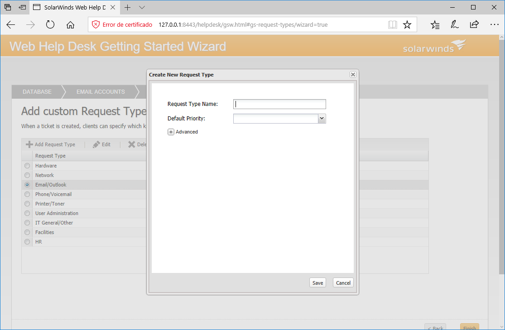
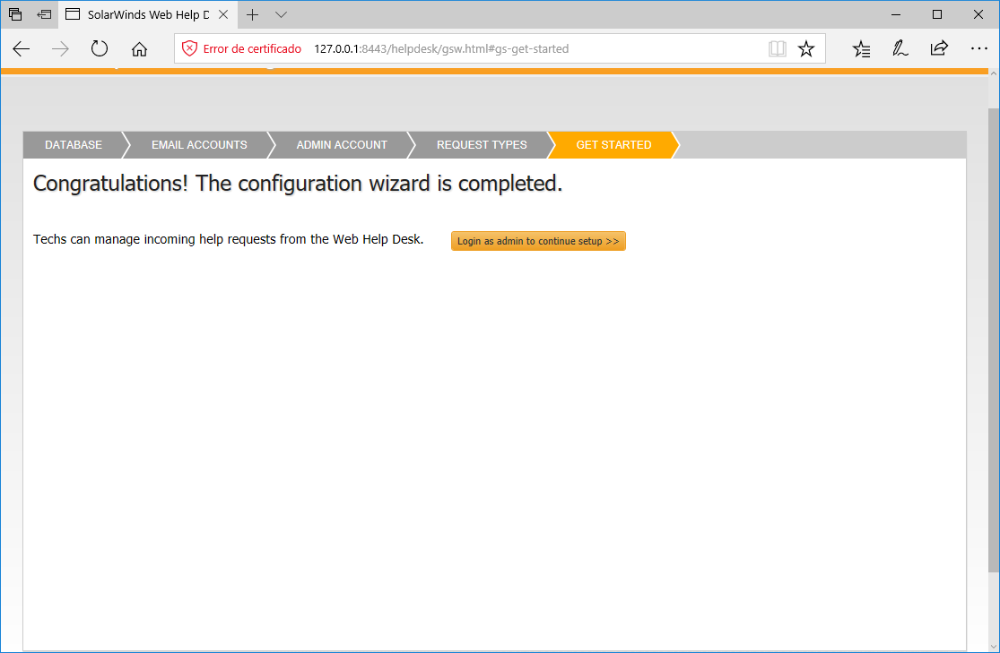

**Solarwinds Helpdesk**

Una vez instalado Solarwinds Helpdesk, debemos abrir el programa como administrador y se nos abre una pestaña en el navegador que tengamos predeterminado.

1. Debemos seleccionar el tipo de **base de datos** que queremos utilizar

2. Decir sobre el email, esta parte es opcional, pero se puede hacer más adelante en **Settings**.

3. Crear una **cuenta de administrador**.

4. Seleccionar que tipo de solicitud requiere el cliente.

- Se puede añadir alguna solicitud que pienses que pueda necesitar el cliente que no esté en la lista.

- Y con esto ya estaría configurado

