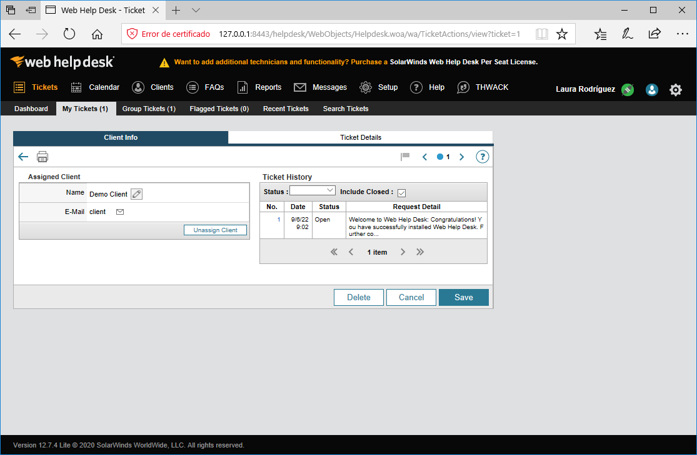

Una vez hechas todas las configuraciones nos aparecen distintas pestañas:

**1. My Tickets**: Aquí podemos ver los tickets que entran.

- Al seleccionarlo aparecen los datos de la incidencia (datos del cliente, problema, fecha de la incidencia, notas, historial…) en la pestaña **Client Info**.

- En la pestaña **Tickets Details** aparecen todos los detalles del ticket.

**2. Calendar**: muestra todas las incidencias que tenemos abiertas .

**3. Clients**: Aquí podemos buscar o añadir nuevos clientes.

**4. FAQs**: En este apartado se pueden añadir preguntas frecuentes.

**5. Reports**: En esta pestaña se pueden ver los reportes.

**6. Messages**:Aquí te puedes comunicar con técnicos, clientes o enviar mensaje público.

**7. Settings**: Aquí tenemos la configuración.

